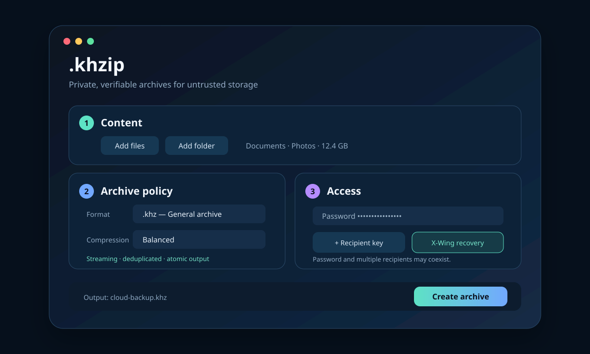
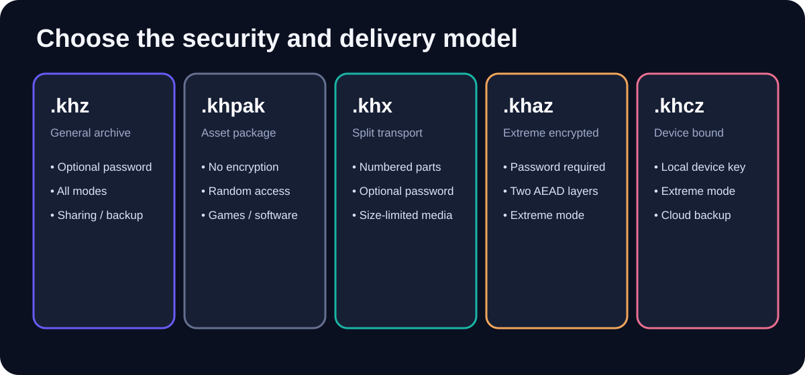
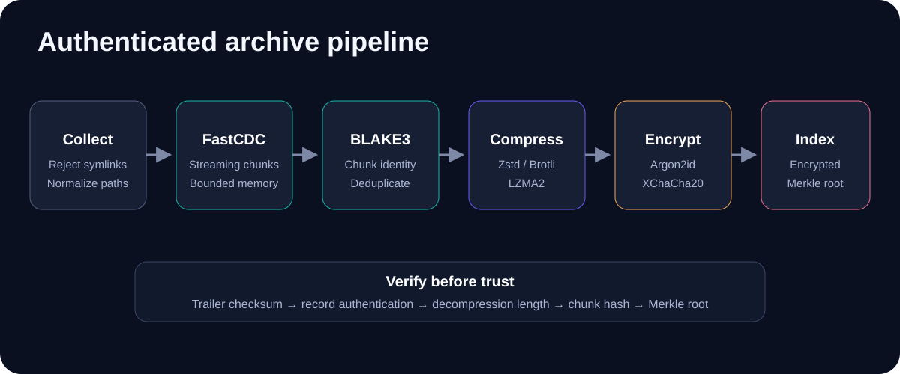

<p align="center">
  
</p>

<p align="center">
  Secure, versioned compressed archives designed for local storage and untrusted third-party clouds.
</p>

<p align="center">
  <a href="https://github.com/YanagiKH/.khzip/actions/workflows/ci.yml"></a>
  <a href="SECURITY.md"></a>
  <a href="LICENSE-MIT"></a>
</p>

> [!IMPORTANT]
> `.khzip` is an early security-focused implementation, not an audited cryptographic product. Use redundant backups, keep recovery keys offline, and test restoration before deleting source data.

## What it provides

- A Rust CLI and optional desktop window.
- Versioned binary containers with encrypted indexes and filenames.
- Streaming FastCDC-style content-defined chunking with cross-file deduplication.
- Zstandard for fast/balanced data, Brotli for text-like data, and LZMA2 for extreme binary compression.
- BLAKE3 chunk identities and a Merkle integrity root.
- Argon2id password derivation and independently authenticated XChaCha20-Poly1305 records.
- Safe extraction that rejects absolute paths, parent traversal, NUL paths, and symbolic links.
- Split archives, device-bound archives, Windows context-menu integration, release installers, CI, and security checks.

<p align="center">
  
</p>

## Archive formats

| Format | Intended use | Encryption | Compression behavior |
|---|---|---:|---|
| `.khz` | General sharing and backups | Optional password | User-selected mode |
| `.khpak` | Readable game/software asset package | Not allowed | User-selected mode |
| `.khx` | Multi-part transport or size-limited storage | Optional password | User-selected mode |
| `.khaz` | Maximum compression and hardened password protection | Required, two independent AEAD layers | Extreme |
| `.khcz` | Device-bound cloud backup | Required local device key | Extreme |

Splitting a `.khx` archive is not cryptographic protection. Missing parts make the archive incomplete, but confidentiality requires password encryption.

<p align="center">
  
</p>

## Install

### Prebuilt release

Linux/macOS:

```bash
curl -fsSL https://raw.githubusercontent.com/YanagiKH/.khzip/main/install/install.sh | sh
```

Windows PowerShell:

```powershell
irm https://raw.githubusercontent.com/YanagiKH/.khzip/main/install/install.ps1 | iex
```

Release installers verify the SHA-256 checksum published with the matching GitHub Release.

### Cargo

```bash
cargo install --git https://github.com/YanagiKH/.khzip
```

Desktop window:

```bash
cargo install --git https://github.com/YanagiKH/.khzip --features gui --bin khzip-gui
```

### Build from source

```bash
git clone https://github.com/YanagiKH/.khzip.git
cd .khzip
cargo test --all-targets
cargo build --release
cargo build --release --features gui --bin khzip-gui
```

Platform build dependencies are listed in [docs/INSTALL.md](docs/INSTALL.md).

## Quick start

Create a password-encrypted `.khz` archive:

```bash
khzip create Documents Photos \
  --output cloud-backup.khz \
  --mode balanced \
  --password
```

Create an extreme archive:

```bash
khzip create Project \
  --output Project.khaz \
  --format khaz \
  --mode extreme \
  --password
```

Create a split encrypted archive with 2 GiB parts:

```bash
khzip create Dataset \
  --output Dataset.khx \
  --password \
  --split-size 2147483648
```

The generated files are `Dataset.khx.001`, `Dataset.khx.002`, and so on. Read or extract by passing the first part.

Initialize a device key and create a device-bound archive:

```bash
khzip device-key init
khzip create Private --output Private.khcz --format khcz --mode extreme
```

Back up the device key shown by `khzip device-key path` to a separate offline location. Losing it makes `.khcz` archives unrecoverable. Copying the key to another machine also transfers the ability to decrypt; the security boundary is the key file, not immutable hardware identity.

List, verify, and extract:

```bash
khzip list cloud-backup.khz --password
khzip verify cloud-backup.khz --password
khzip extract cloud-backup.khz --output restored --password
```

For automation, avoid passwords in command arguments:

```bash
export KHZIP_PASSWORD='use-a-secret-manager-in-production'
khzip verify cloud-backup.khz --password-env KHZIP_PASSWORD
```

## Desktop and right-click use

Build or install `khzip-gui`, then open it to select files and folders, choose a format and compression mode, and create an archive.

Windows context menu:

```powershell
powershell -ExecutionPolicy Bypass -File install/windows-context-menu.ps1
```

Linux desktop integration:

```bash
./install/linux-desktop-integration.sh
```

See [docs/GUI.md](docs/GUI.md) for platform details.

<p align="center">
  
</p>

## Security model

Encrypted formats place the codec, plaintext length, BLAKE3 identity, compressed bytes, and manifest inside authenticated ciphertext. Filenames, paths, file sizes, chunk identities, and chunk plaintext lengths are therefore not stored in clear record headers. The container still reveals its version, selected format and mode, encryption flags, record kinds and ordinals, record boundaries, ciphertext lengths, total object size, and manifest location. Every encrypted record has a unique XChaCha20 nonce derived from a random archive prefix and a monotonic record number. Clear framing metadata is bound as associated data. The whole container also has a BLAKE3 corruption checksum.

`.khpak` and unencrypted `.khz`/`.khx` archives provide corruption detection, not authenticity against an attacker who can rewrite the full archive. The trailer checksum is unkeyed and can be recomputed.

The current version deliberately does not expose HPKE/X25519 or ML-KEM key slots. Those require an interoperable key-slot specification, test vectors, migration rules, and independent review before they can be represented as secure. The versioned format reserves expansion space for that work. See [docs/THREAT_MODEL.md](docs/THREAT_MODEL.md) and [docs/FORMAT.md](docs/FORMAT.md).

## Compression modes

- `fast`: Zstandard level 1.
- `balanced`: Brotli for text-like chunks and Zstandard for other data.
- `extreme`: Brotli quality 11 for text-like chunks and LZMA2 level 9 for other data.
- `custom`: User-selected codec levels and FastCDC chunk bounds.

`.khaz` and `.khcz` always use the extreme policy, regardless of a lower requested mode.

## Reliability workflow

Before trusting an archive:

```bash
khzip verify archive.khz --password
mkdir restore-test
khzip extract archive.khz --output restore-test --password
```

Keep at least two independent copies. For `.khcz`, keep an offline device-key backup. For password archives, keep the password in a password manager. Never delete the original solely because archive creation returned success.

## Documentation

- [Installation](docs/INSTALL.md)
- [Desktop UI and shell integration](docs/GUI.md)
- [Binary format](docs/FORMAT.md)
- [Threat model](docs/THREAT_MODEL.md)
- [Debugging and recovery](docs/DEBUGGING.md)
- [Contributing](CONTRIBUTING.md)
- [Security policy](SECURITY.md)

## Project status

Version `0.1.0` is an MVP intended for review and interoperability stabilization. Before a stable release, the project needs independent cryptographic review, fuzzing over the parser and extractor, published compatibility vectors, broader large-file testing, and formal recovery testing on every supported operating system.
