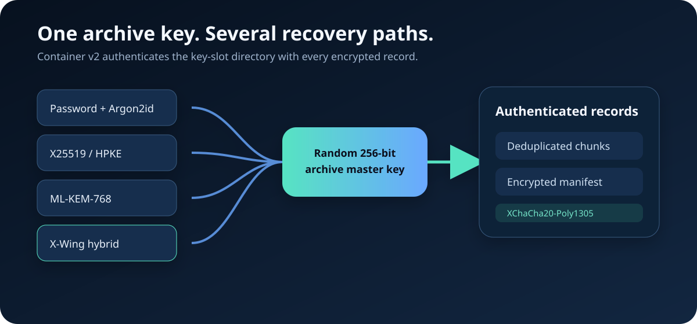

<p align="center">
  
</p>

<p align="center">
  Private, verifiable, deduplicated archives for local storage and untrusted clouds.
</p>

<p align="center">
  <a href="https://github.com/YanagiKH/.khzip/actions/workflows/ci.yml"></a>
  <a href="https://github.com/YanagiKH/.khzip/actions/workflows/security.yml"></a>
  <a href="SECURITY.md"></a>
  <a href="LICENSE-MIT"></a>
</p>

> [!IMPORTANT]
> `.khzip` is security-focused software, not an independently audited cryptographic product. Keep redundant backups, store recovery credentials separately, run `verify`, and test restoration before deleting source data.

## Highlights

- Version 2 containers with a bounded, authenticated multi-recipient key-slot directory.
- Password slots derived with Argon2id.
- HPKE recipient slots using X25519, ML-KEM-768, or X-Wing hybrid post-quantum KEMs.
- Password and multiple public-key recipients in the same archive.
- Version 1 password and device-key archive read compatibility.
- Streaming FastCDC-style content-defined chunking and cross-file deduplication.
- Zstandard, Brotli, and LZMA2 compression policies.
- XChaCha20-Poly1305 authenticated record encryption; `.khaz` applies two layers.
- BLAKE3 content identities, whole-container corruption checksum, and Merkle verification.
- Safe extraction that rejects absolute paths, parent traversal, NUL paths, and symbolic links.
- Split archives, device-key archives, CLI, optional desktop creator, installers, and cross-platform CI.

<p align="center">
  
</p>

## Archive formats

| Format | Intended use | Access control | Compression |
|---|---|---|---|
| `.khz` | Default sharing and backup | Optional password and/or recipients | Selected mode |
| `.khpak` | Game/software asset package | Intentionally unencrypted | Selected mode |
| `.khx` | Split transport or size-limited storage | Optional password and/or recipients | Selected mode |
| `.khaz` | Hardened, maximum-compression archive | Password or recipient required; two record-encryption layers | Extreme |
| `.khcz` | Unattended local-device cloud backup | Required local device key | Extreme |

Splitting a `.khx` archive is transport behavior, not cryptographic protection.

## Install

### Cargo

```bash
cargo install --git https://github.com/YanagiKH/.khzip
```

Desktop creator:

```bash
cargo install --git https://github.com/YanagiKH/.khzip --features gui --bin khzip-gui
```

### Release installer

After a GitHub Release is published, the bundled installers download the matching asset and verify its SHA-256 file:

```bash
curl -fsSL https://raw.githubusercontent.com/YanagiKH/.khzip/main/install/install.sh | sh
```

```powershell
irm https://raw.githubusercontent.com/YanagiKH/.khzip/main/install/install.ps1 | iex
```

### Source build

Rust 1.88 or newer is required.

```bash
git clone https://github.com/YanagiKH/.khzip.git
cd .khzip
cargo test --all-targets
cargo build --release
cargo check --features gui --bin khzip-gui
```

See [Installation](docs/INSTALL.md) for platform packages.

## Password archive

```bash
khzip create Documents Photos \
  --output cloud-backup.khz \
  --mode balanced \
  --password

khzip verify cloud-backup.khz --password
khzip extract cloud-backup.khz --password --output restored
```

For automation, load passwords from a secret manager into an environment variable rather than a process argument:

```bash
export KHZIP_PASSWORD='managed-secret-value'
khzip verify cloud-backup.khz --password-env KHZIP_PASSWORD
```

## Public-key and post-quantum recipients

Generate the recommended X-Wing hybrid keypair:

```bash
khzip key generate \
  --algorithm x-wing \
  --public recovery.khpub \
  --secret recovery.khsec
```

Other supported values are `x25519` and `ml-kem-768`.

Create an archive for several recipients and an independent password recovery path:

```bash
khzip create Project \
  --output Project.khaz \
  --recipient alice.khpub \
  --recipient recovery.khpub \
  --password
```

Read it with any applicable identity or the password:

```bash
khzip verify Project.khaz --identity recovery.khsec
khzip extract Project.khaz --identity alice.khsec --output Project-restored
```

See [Recipient keys](docs/KEYS.md) for key handling and recovery guidance.

## Split and device-key archives

Create 2 GiB split parts:

```bash
khzip create Dataset \
  --output Dataset.khx \
  --recipient recovery.khpub \
  --split-size 2147483648
```

Read or extract by passing `Dataset.khx.001`.

Initialize the local device key and create a `.khcz` archive:

```bash
khzip device-key init
khzip create Private --output Private.khcz --format khcz --mode extreme
```

`khzip device-key path` prints the key location. Copying the key transfers decrypt capability; losing every copy makes `.khcz` archives unrecoverable.

## Desktop workflow

The desktop creator uses a three-stage flow: select **Content**, choose an **Archive policy**, then configure **Access** with a password or recipient public keys.

<p align="center">
  
</p>

Windows context menu:

```powershell
powershell -ExecutionPolicy Bypass -File install/windows-context-menu.ps1
```

Linux desktop integration:

```bash
./install/linux-desktop-integration.sh
```

## Security model

Encrypted records keep codec, plaintext length, BLAKE3 identity, compressed data, paths, file sizes, and the manifest inside authenticated ciphertext. The container still reveals its format, mode, encryption flags, key-slot algorithms and approximate sizes, truncated recipient fingerprints, record boundaries and kinds, ciphertext lengths, total size, and manifest location.

Each archive uses a random master key. Password and recipient slots independently wrap that master key. X-Wing is recommended where hybrid post-quantum protection is desired; ML-KEM-768 is available for pure post-quantum policy, and X25519 for classical compatibility. Algorithm availability does not constitute an independent implementation audit or a guarantee against future cryptanalytic changes.

Unencrypted archives provide corruption detection, not authenticity against an attacker who can rewrite the complete archive and checksum.

Read the [Threat model](docs/THREAT_MODEL.md) and [Binary format](docs/FORMAT.md) before relying on the software for high-value data.

## Verification workflow

```bash
khzip verify archive.khz --identity recovery.khsec
mkdir restore-test
khzip extract archive.khz --identity recovery.khsec --output restore-test
```

A green CI run proves that the checked commit passed the configured builds and tests. It does not prove that no defect exists. Stable release criteria include independent cryptographic review, published cross-language vectors, parser fuzzing history, large-file soak tests, and repeated recovery exercises.

## Documentation

- [Product design](docs/PRODUCT.md)
- [Recipient keys](docs/KEYS.md)
- [Installation](docs/INSTALL.md)
- [Desktop UI and shell integration](docs/GUI.md)
- [Binary format](docs/FORMAT.md)
- [Threat model](docs/THREAT_MODEL.md)
- [Debugging and recovery](docs/DEBUGGING.md)
- [Contributing](CONTRIBUTING.md)
- [Security policy](SECURITY.md)

## Status

Version `0.2.0` introduces container v2 recipient slots and preserves v1 reading. The format remains pre-1.0 and may evolve through explicit versioning and migration documentation.
